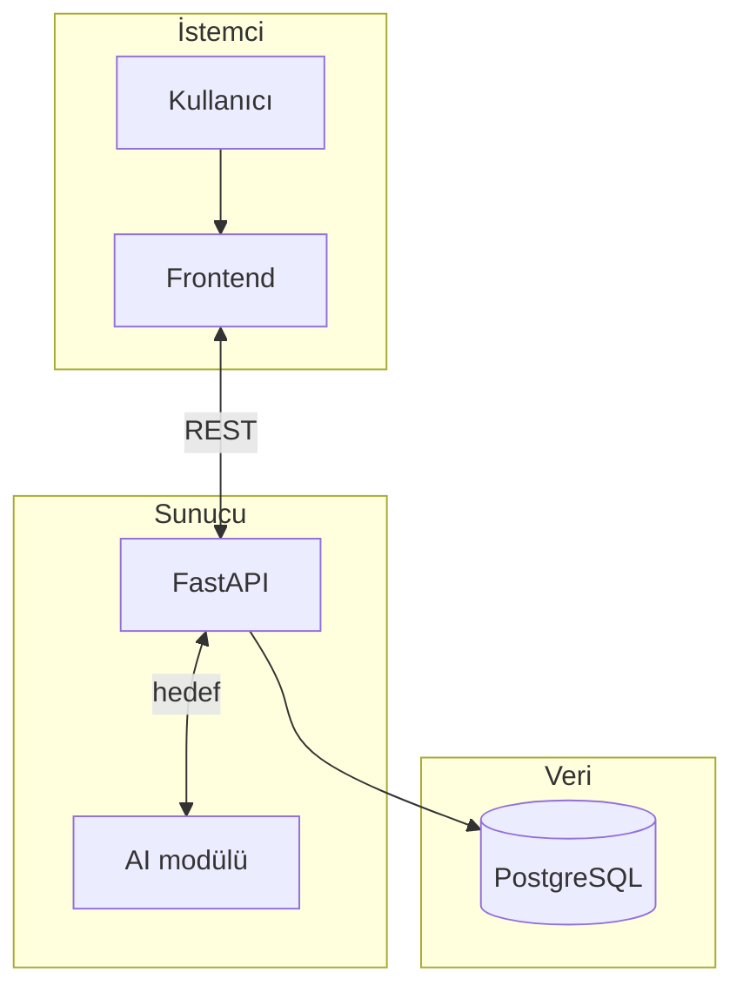
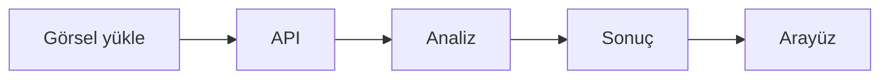
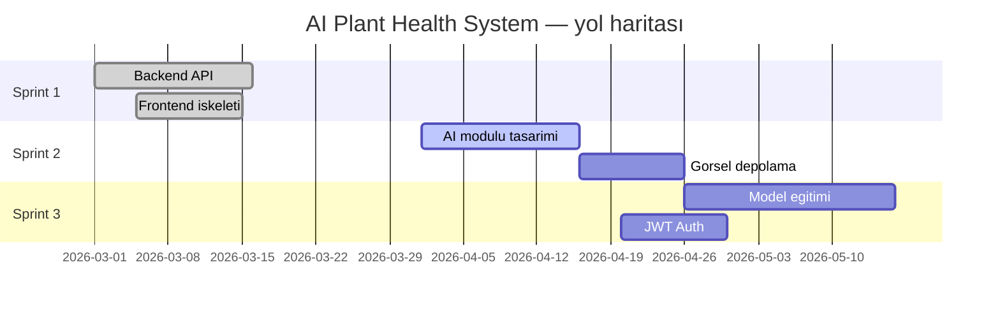

<div align="center">

# AI Plant Health System

**Bitki görüntüsü ve sağlık kayıtlarını REST API üzerinden yönetir. Yapay zekâ ile hastalık ön değerlendirmesi sonraki fazlarda eklenecektir.**

*Öğrenci ekibi · sprint / faz bazlı geliştirme · MIT Lisansı*

<br>


[](https://fastapi.tiangolo.com/)
[](https://react.dev/)

[](https://www.typescriptlang.org/)
[](https://www.postgresql.org/)
[](LICENSE)

<br>

Bu depoyu bir **öğrenci ekibi**, işi **sprint ve fazlara** bölerek geliştiriyor.  
Backend (FastAPI + PostgreSQL) ve frontend (React + TypeScript + Vite) **çalışır durumda**. **Yapay zekâ modülü yok:** eğitilmiş model, gerçek tahmin ve veri seti entegrasyonu henüz yapılmadı; `/ai/*` yolları yalnızca **yer tutucu** yanıt verir.

</div>

<br>

## İçindekiler

[1. Genel bakış](#1-genel-bakış) · [2. Özellikler](#2-özellikler) · [3. Ekran görüntüleri](#3-ekran-görüntüleri) · [4. Teknoloji ve mimari](#4-teknoloji-ve-mimari) · [5. API özeti](#5-api-özeti) · [6. Klasör yapısı](#6-klasör-yapısı) · [7. Kurulum](#7-kurulum) · [8. Kullanım](#8-kullanım) · [9. Proje durum ve yol haritası](#9-proje-durum-ve-yol-haritası) · [10. Katkı](#10-katkı) · [Lisans](#lisans)

---

## 1. Genel bakış

**Amaç:** Bitki görüntüleri ve kayıtlar üzerinden hastalık **ön değerlendirmesi**. Kodda fazlar Sprint 1–2 notlarıyla işaretli.

**Şu an var olanlar**

- İlişkisel veri modeli ve CRUD API  
- OpenAPI dokümantasyonu (`/docs`, `/redoc`)  
- React tarafında sayfa ve yönlendirme iskeleti  

**Şu an olmayanlar veya taslak olanlar**

- **AI modülü:** gerçek model çıkarımı yok; `/ai/*` sabit / örnek gövde döner.  
- **Veri seti hattı:** model eğitimi ve üretim entegrasyonu planlı.  
- Kalıcı görsel depolama ve üretim düzeyi kimlik doğrulama (şifre hash, JWT) — planlı.  

Uygulama uzman teşhisi veya laboratuvar analizinin yerini tutmaz; sonuçlar yalnızca yardımcı niteliktedir.

---

## 2. Özellikler

| Çalışan | Planlı veya üzerinde çalışılan |
|:--------|:--------------------------------|
| FastAPI, CORS, OpenAPI | Şifre hash, JWT |
| PostgreSQL; `users`, `plants`, `disease_records` | Kalıcı görsel yükleme ve depolama |
| `/ai/*` için route tanımları (yer tutucu yanıt) | Model bağlama, gerçek tahmin |
| React 19, Router, temel sayfalar | Tüm ekranlarda tam API entegrasyonu |

---

## 3. Ekran görüntüleri

Örnek dosya adları: `landing`, `dashboard`, `analyze`, `swagger`. Görselleri `docs/screenshots/` içine koyup aşağıdaki gibi bağlayın:

```markdown

```

---

## 4. Teknoloji ve mimari

**Backend:** Python 3 · FastAPI · Uvicorn · SQLAlchemy · PostgreSQL · Pydantic v2 · python-dotenv  

**Frontend:** React 19 · TypeScript · Vite · React Router · Tailwind CSS · Lucide React  

Şemadaki **AI modülü** hedef mimariyi gösterir; **gerçek çıkarım kodu henüz bağlı değil** (`backend/app/routes/ai_detection.py`).



---

## 5. API özeti

Güncel istek/yanıt şeması için tarayıcıda **`/docs`** kullanın. Tablodaki kısa yollar **taslak isimlendirme** içindir.

| Taslak yol | Projede karşılığı | Durum |
|:-----------|:------------------|:------|
| `GET /health` | `GET /` | Çalışır (kök / sağlık yanıtı) |
| `POST /upload` | `POST /ai/upload_image` | Uç nokta var; **içerik yer tutucu** |
| `POST /predict` | `POST /ai/detect_disease` | Uç nokta var; **tahmin yok**, yer tutucu |
| `GET /diseases` | — | **Tanımlı değil** |

Kullanıcı, bitki ve kayıt için: `/users/`, `/plants/`, `/disease-records/` — ayrıntı: [`backend/README.md`](backend/README.md).

---

## 6. Klasör yapısı

```
.
├── backend/app/      main.py, config/, database/, models/, routes/, schemas/
├── frontend/src/     pages/, components/, context/, App.tsx, main.tsx
├── LICENSE
└── README.md
```

---

## 7. Kurulum

**Ön koşullar:** Python 3.10+, Node.js 20+, PostgreSQL.

Veritabanı:

```sql
CREATE DATABASE plant_health_db;
```

Backend (komutlar `backend` klasöründe):

```bash
cd backend
python -m venv venv
source venv/bin/activate          # Windows: venv\Scripts\activate
pip install -r requirements.txt
cp .env.example .env              # Windows: copy .env.example .env
python check_setup.py             # isteğe bağlı
uvicorn app.main:app --reload
```

Frontend:

```bash
cd frontend
npm install
npm run dev
```

- API: `http://localhost:8000`  
- Swagger: `http://localhost:8000/docs`  
- Arayüz: genelde `http://localhost:5173`  

Önizleme derlemesi: `npm run build && npm run preview`

---

## 8. Kullanım

1. PostgreSQL ve `.env` hazırsa backend’i `uvicorn` ile başlatın.  
2. API’yi `/docs` veya bir HTTP istemcisiyle deneyin.  
3. Frontend için `npm run dev` kullanın.  
4. **`/ai/*` gerçek model çalıştırmaz**; yanıtlar yer tutucudur.  

Aşağıdaki şema **hedef akışı** gösterir; “Analiz” adımı model gelene kadar API’de gerçek sınıflandırma anlamına gelmez.



---

## 9. 🌟 Proje durum ve yol haritası

### Durum rozetleri


[](https://github.com/Weli-byte/ai-plant-health-system/commits)


*Üst bölümdeki teknik yığın rozetlerine ek olarak burada süreç ve depo özeti yer alır. Gri rozetler: ölçülen test coverage ve tanımlı GitHub Actions iş akışı şu an yok demektir.*

---

### 🚀 Sprint planı (Gantt)

Aşağıdaki çizelge **örnek tarihlidir**; ekip backlog’una göre kayar. Sprint 1’deki maddeler kodla uyumlu olacak şekilde **tamamlandı** kabul edilir.



---

### İş listesi ve dal akışı

Ekip işleri **sprint / faz** ile planlar; tamamlanan işler README ve kodla uyumlu tutulmalıdır.

- [x] API, veri modeli, istemci iskeleti  
- [ ] Şifre hash ve JWT  
- [ ] Görsel yükleme ve depolama  
- [ ] Model, veri seti ve **gerçek** `/ai/*` yanıtları  
- [ ] İsteğe bağlı: risk analizi, CI/CD  

**Dal akışı:** `main` → kısa ömürlü dal → yerel test (`check_setup.py`, `/docs`, `npm run lint`, `npm run build`) → PR → inceleme → birleştirme.

---

## 10. Katkı

Bu depo bir **öğrenci ekibi** projesidir. Dışarıdan katkı için önce ekip veya danışmanla görüşün. Ekip içinde küçük PR’lar, net commit mesajları ve yeni bağımlılıkların `requirements.txt` / `package.json` ile gelmesi yeterlidir.

---

## PlantVillage Dataset Structure

Bu veri setinin klasör yapısı incelenmiştir.
Her sınıf klasörü "Bitki___Hastalık" formatındadır.

Veri setinde bulunan bitki türleri:

- apple
- blueberry
- cherry_(including_sour)
- corn_(maize)
- grape
- orange
- peach
- pepper,_bell
- potato
- raspberry
- soybean
- squash
- strawberry
- tomato

Toplam bitki türü: 14

---

## Lisans

[MIT](LICENSE)

<br>

<div align="center">

**AI Plant Health System** — *Öğrenci ekibi · sprint/faz ile güncellenir; kapsamı commit’lerle birlikte değerlendirin.*

</div>
